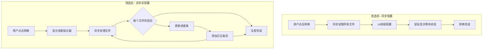
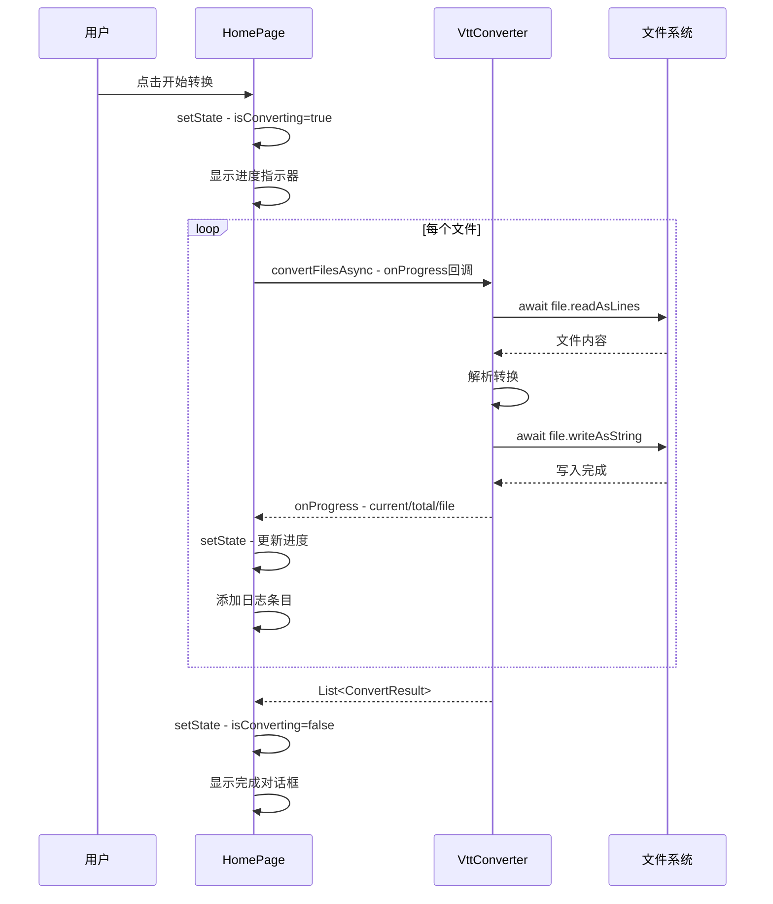

# 方案三：异步化转换 + 进度反馈实施计划

## 目标

将 VTT 转换过程从同步阻塞改为异步非阻塞，并添加实时进度反馈，解决鼠标等待状态问题，提升用户体验。

## 架构变更



## 文件修改清单

### 1. lib/core/vtt_converter.dart

**改动内容**：将同步方法改为异步方法

| 原方法 | 新方法 | 改动说明 |
|--------|--------|----------|
| `convertVttToLrc` | `convertVttToLrcAsync` | 添加 async，使用异步IO |
| `convertFiles` | `convertFilesAsync` | 改为异步流式处理，支持进度回调 |

**新增参数**：
- `onProgress` 回调：每完成一个文件时通知调用方

### 2. lib/ui/home_page.dart

**改动内容**：添加转换状态管理和进度显示

| 改动项 | 说明 |
|--------|------|
| 新增 `_isConverting` 状态 | 标记是否正在转换 |
| 新增 `_convertProgress` 状态 | 当前转换进度 |
| 修改 `_onConvert()` | 改为异步方法 |
| 新增进度指示器 UI | 显示当前进度和文件名 |

### 3. lib/ui/progress_indicator.dart（可选新建）

**改动内容**：独立的进度指示器组件

---

## 详细实施步骤

### 阶段一：异步化核心转换逻辑

#### Step 1.1: 修改 `convertVttToLrc` 为异步方法

```dart
// 改造前
String convertVttToLrc(String path) {
  final file = File(path);
  final lines = file.readAsLinesSync(encoding: SystemEncoding());
  // ...
  File(lrcPath).writeAsStringSync(out.join('\n'));
  return lrcPath;
}

// 改造后
Future<String> convertVttToLrcAsync(String path) async {
  final file = File(path);
  final lines = await file.readAsLines(encoding: SystemEncoding());
  // ...
  await File(lrcPath).writeAsString(out.join('\n'));
  return lrcPath;
}
```

#### Step 1.2: 修改 `convertFiles` 为异步流式处理

```dart
// 改造后
typedef ProgressCallback = void Function(int current, int total, String file);

Future<List<ConvertResult>> convertFilesAsync(
  List<String> filePaths, {
  ProgressCallback? onProgress,
}) async {
  final results = <ConvertResult>[];
  final vttFiles = filePaths.where(
    (p) => p.toLowerCase().endsWith('.vtt')
  ).toList();
  
  for (var i = 0; i < vttFiles.length; i++) {
    final path = vttFiles[i];
    
    // 通知进度
    onProgress?.call(i + 1, vttFiles.length, path);
    
    // 异步处理单个文件
    try {
      if (!await File(path).exists()) continue;
      final lrcPath = await convertVttToLrcAsync(path);
      results.add(ConvertResult.success(path, lrcPath));
    } on FileSystemException catch (e) {
      results.add(ConvertResult.failure(path, '文件访问失败：${e.message}'));
    } catch (e) {
      results.add(ConvertResult.failure(path, '转换失败：$e'));
    }
  }
  return results;
}
```

---

### 阶段二：UI 状态管理

#### Step 2.1: 添加状态变量

```dart
class _HomePageState extends State<HomePage> {
  // 现有状态...
  
  // 新增状态
  bool _isConverting = false;
  int _convertedCount = 0;
  int _totalCount = 0;
  String _currentFile = '';
}
```

#### Step 2.2: 重构 `_onConvert` 方法

```dart
Future<void> _onConvert() async {
  if (_isConverting) return;  // 防止重复点击
  
  List<String> filesToConvert = [];
  // ... 获取文件列表的逻辑保持不变 ...
  
  setState(() {
    _isConverting = true;
    _convertedCount = 0;
    _totalCount = filesToConvert.length;
    _currentFile = '';
  });
  
  _log('开始转换 $_totalCount 个文件…', color: _colorInfo);
  
  final results = await convertFilesAsync(
    filesToConvert,
    onProgress: (current, total, file) {
      setState(() {
        _convertedCount = current;
        _currentFile = p.basename(file);
      });
      // 实时记录日志
      final result = results.isNotEmpty ? results.last : null;
      if (result != null) {
        if (result.isSuccess) {
          _log('✔ ${p.basename(result.source)}  →  ${p.basename(result.destination!)}', 
               color: _colorSuccess);
        } else {
          _log('✘ ${p.basename(result.source)}  →  ${result.error}', 
               color: _colorError);
        }
      }
    },
  );
  
  setState(() {
    _isConverting = false;
    _convertedCount = 0;
    _totalCount = 0;
    _currentFile = '';
  });
  
  // ... 处理结果显示 ...
}
```

---

### 阶段三：进度指示器 UI

#### Step 3.1: 在按钮下方添加进度区域

```dart
// 在 开始转换按钮 下方添加
if (_isConverting) ...[
  const SizedBox(height: 12),
  _buildProgressIndicator(),
],

Widget _buildProgressIndicator() {
  return Container(
    padding: const EdgeInsets.all(12),
    decoration: BoxDecoration(
      color: isDark ? const Color(0xFF2A2A2A) : const Color(0xFFE8E8E8),
      borderRadius: BorderRadius.circular(8),
    ),
    child: Column(
      crossAxisAlignment: CrossAxisAlignment.start,
      children: [
        Row(
          children: [
            const SizedBox(
              width: 16,
              height: 16,
              child: CupertinoActivityIndicator(),
            ),
            const SizedBox(width: 8),
            Text(
              '正在转换: $_currentFile',
              style: TextStyle(fontSize: 12),
            ),
          ],
        ),
        const SizedBox(height: 8),
        ClipRRect(
          borderRadius: BorderRadius.circular(4),
          child: LinearProgressIndicator(
            value: _totalCount > 0 ? _convertedCount / _totalCount : 0,
            backgroundColor: isDark ? Colors.grey[700] : Colors.grey[300],
            valueColor: AlwaysStoppedAnimation(_colorInfo),
          ),
        ),
        const SizedBox(height: 4),
        Text(
          '$_convertedCount / $_totalCount',
          style: TextStyle(fontSize: 11, color: _colorMuted),
        ),
      ],
    ),
  );
}
```

#### Step 3.2: 禁用按钮防止重复操作

```dart
PushButton(
  controlSize: ControlSize.large,
  onPressed: (_canConvert && !_isConverting) ? _onConvert : null,
  child: _isConverting 
      ? const Row(
          mainAxisSize: MainAxisSize.min,
          children: [
            SizedBox(
              width: 14,
              height: 14,
              child: CupertinoActivityIndicator(color: Colors.white),
            ),
            SizedBox(width: 8),
            Text('转换中...'),
          ],
        )
      : const Text('开始转换'),
),
```

---

## 数据流图



---

## 测试要点

1. **功能测试**
   - 单文件转换正常
   - 多文件批量转换正常
   - 转换失败时正确显示错误信息

2. **UI 测试**
   - 转换过程中鼠标保持正常状态
   - 进度条正确更新
   - 日志实时滚动显示
   - 按钮禁用状态正确

3. **边界测试**
   - 空文件列表
   - 大文件转换
   - 网络驱动器上的文件

---

## 风险与缓解

| 风险 | 影响 | 缓解措施 |
|------|------|----------|
| 异步改造引入bug | 转换失败 | 保留原同步方法作为备份 |
| 进度更新过于频繁 | UI卡顿 | 使用节流或防抖 |
| 大文件内存占用 | 内存溢出 | 考虑流式读取 |

---

## 后续优化（可选）

1. **取消功能**：添加取消按钮，使用 `CancelableOperation` 或标志位中断转换
2. **并行处理**：使用 `Future.wait` 或 `Isolate` 并行处理多个文件
3. **速度统计**：显示转换速度和预计剩余时间
